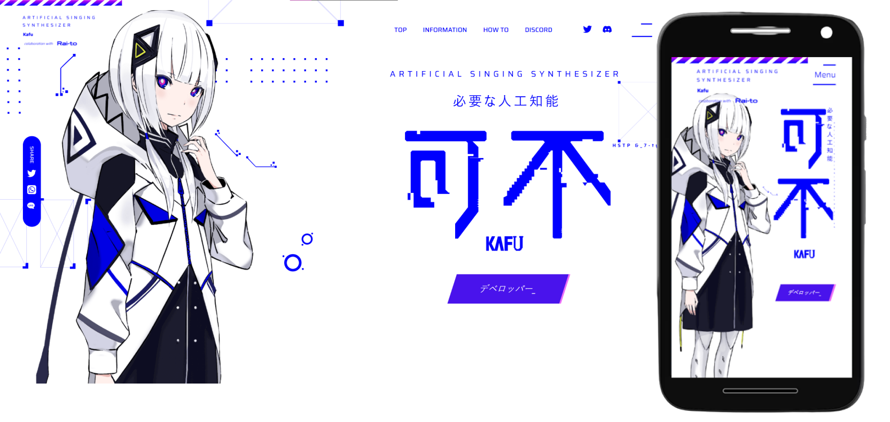

<h1 align="center">
    Kaf-u 
</h1>

  

  <a href="#-tecnologias">Tecnologias</a>&nbsp;&nbsp;&nbsp;|&nbsp;&nbsp;&nbsp;
  <a href="#-projeto">Projeto</a>&nbsp;&nbsp;&nbsp;|&nbsp;&nbsp;&nbsp;
  <a href="#memo-licença">Licença</a>

 
  

  

 

  

## 🔹 Tecnologias 🔹

Esse projeto foi desenvolvido com as seguintes tecnologias:

- HTML  

  - CSS /  SASS   
  
  - JavaScript  
  
  🟢 - Gsap

## 🚧 Projeto

Live Preview: https://llucasbruno.github.io/KAF-u/#
## :memo: Licença

Esse projeto está sob a licença MIT. Veja o arquivo [LICENSE](LICENSE) para mais detalhes.

---

Feito com ♥ by llucasbruno

  
 
     
